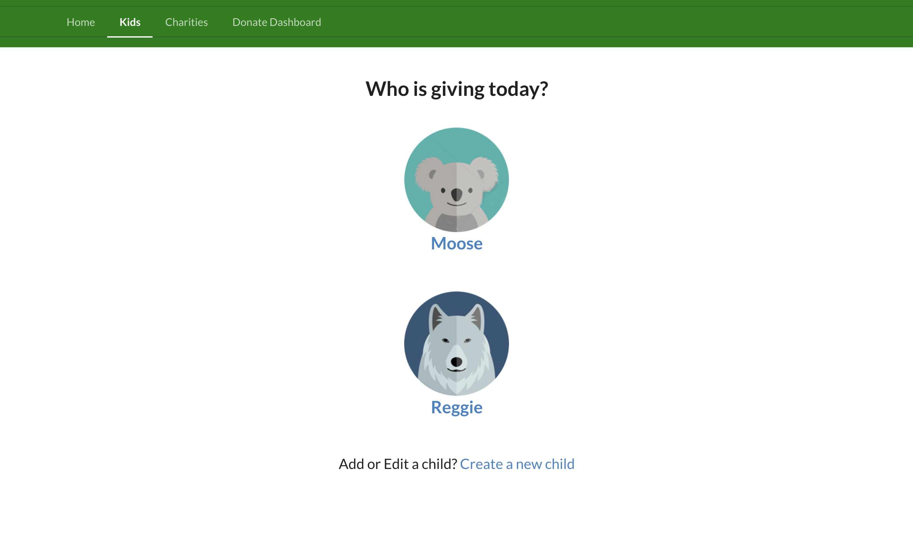
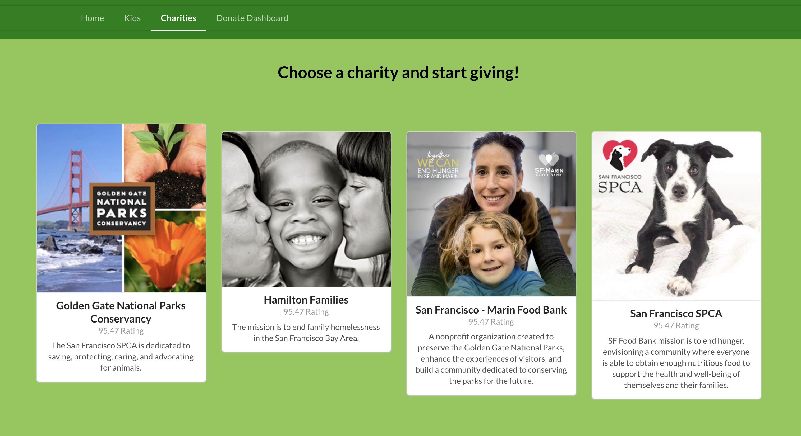

# Teach Giving

Teaching children to give to charity.

##### Can I give a tiny bit of money and will that even help?

When you give small amounts, even "nano" amounts, it can add up to something significant over time.
Inspire children with giving goals. (Give early. Give often.)

##### The Solution:

A web app to make giving easy! A user can sign up and add children. Each child can pick an avatar and choose a charity they want to give to. They can choose the amount of money and the number of weeks they want to give.

##### Screenshots:

---

##### Tech:

Teachgiving was built using React.
This web app is supported with a postreSQL database, using KNEX, Node.js and Express Server.
[link to teachgiving-backend on github](https://github.com/corrimori/teachgiving_backend.git)
